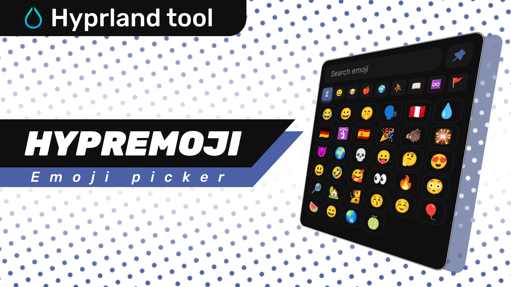
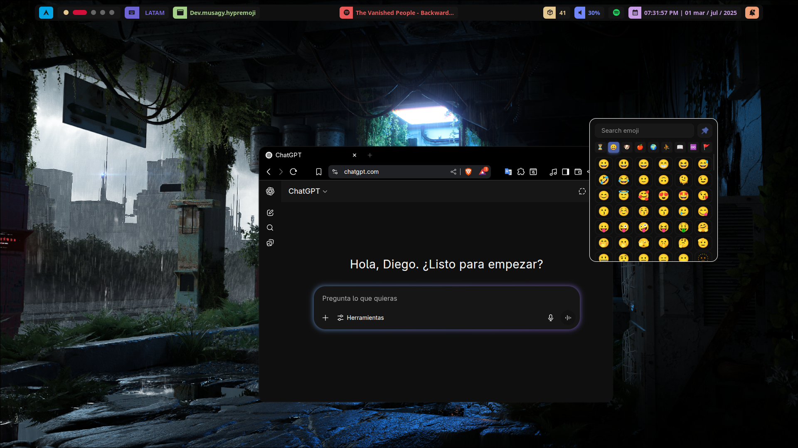

📘 Also available in [English 🇬🇧](./README.md)

# 😀 HyprEmoji

HyprEmoji es un selector de emojis ligero y rápido para el gestor de ventanas **Hyprland**, construido con GTK4 y Rust.  
¡Una forma elegante de copiar emojis en cualquier ventana de tu sistema!

  


## ✨ Características

- 🔍 **Búsqueda instantánea:** encuentra emojis escribiendo su nombre (con debounce incluido).
- 📂 **Navegación por categorías:** Caritas, Animales, Comida, Objetos ¡y más!
- 📋 **Copia automática con Ctrl+V** en la ventana enfocada.
- 🧠 **Historial reciente:** los emojis más usados se guardan automáticamente.
- 🎨 **Interfaz moderna y minimalista**, personalizable mediante CSS.
- 💾 **Recuerda el tamaño y posición de la ventana** entre sesiones.

## 📥 Instalación

### 📦 Desde AUR *(recomendado)*

```bash
paru -S hypremoji
```

O...

```bash
yay -S hypremoji
```

> ✅ Una vez instalado, intentará autoconfigurar tu `hyprland.conf` con las reglas necesarias.

🎉 Lanza con `Super` + `.` ¡y a disfrutar!

## ⚙️ Instalación manual

### 📦 Requisitos

- **Rust + Cargo**
- **GTK 4**
- **Hyprland** (con `hyprctl`)
- **wl-clipboard** (`wl-copy`, `wl-paste`)
- **Fuente de emojis como Noto Color Emoji (por defecto)**

### 🚀 Pasos

1. 🎯 Asegúrate de tener **Rust** y **GTK 4** instalados.
2. 📥 Clona el repositorio:

```bash
git clone https://github.com/Musagy/HyprEmoji.git
cd HyprEmoji
```

> ¿Usas Arch? Corre simplemente `makepkg -si` y listo.  
> Si no, continúa con los pasos siguientes.

3. ⚙️ Agrega esto a tu `hyprland.conf`:

```conf
# Variable de entorno para el ejecutable
$hypremoji = ~/ruta/del/proyecto/target/release/hypremoji

# SUPER + PUNTO para abrir Hypremoji
bind = Super, period, exec, $hypremoji

# Reglas de ventana para Hypremoji
windowrulev2 = float, title:^(HyprEmoji)$
```

4. 🛠️ Compílalo:

```bash
cargo build --release
```

5. 🎉 Lanza con `Super` + `.` ¡y a disfrutar!

### Instalación rápida de dependencias (Arch Linux):

```bash
sudo pacman -S gtk4 wl-clipboard noto-fonts-emoji
```

### En Debian/Ubuntu:

```bash
sudo apt install libgtk-4-dev wl-clipboard fonts-noto-color-emoji
```

> ⚠️ También necesitas una sesión activa de Hyprland para que funcione.

## 🎨 Personalización

Puedes modificar el tema desde:

```bash
~/.config/hypremoji/style.css
```

#### Ejemplo:

```css
:root {
  --primary-col: #4b60a5;
  --primary-col-glow: #4b60a5aa;
  --gray: #444;
  --bg-col: #0F0F0F;
  --input-text-col: #FFFFFF;
  --btn-list-col: #181818;
  --entry-unfocus: #c41313;
  --btn-list-col-hover: #272727;
  --btn-list-col-hover-glow: #27272777;
  --btn-nav-col: #3E3E3E;
  --btn-nav-col-hover: #0F0F0F;
  --emoji-font: "Noto Color Emoji";
}
```

> 💬 ¿Quieres el clásico estilo de emojis de Discord? Mira [Twemoji](https://github.com/twitter/twemoji), es la fuente que usan ellos.

#### Cómo cambiar el color del icono 📌

Edita el valor `fill="#xxxxxx"` en:

```bash
/usr/share/hypremoji/assets/icons/AiFillPushpin.svg
```

## 🤝 Contribuciones

¡Las ideas, reportes de errores y *pull requests* son muy bienvenidas!  
Abre un [issue](https://github.com/Musagy/HyprEmoji/issues) o colabora directamente.

## 📄 Licencia

Este proyecto está licenciado bajo **ISC**. Revisa [`LICENSE`](./LICENSE) para más detalles.

## 💸 Apóyame

<p align="center"> 
  <a href="https://www.buymeacoffee.com/musagy" target="_blank" >
    
  </a>
</p>

  

<p align="center"> Tengo hambre 🥵 </p>
