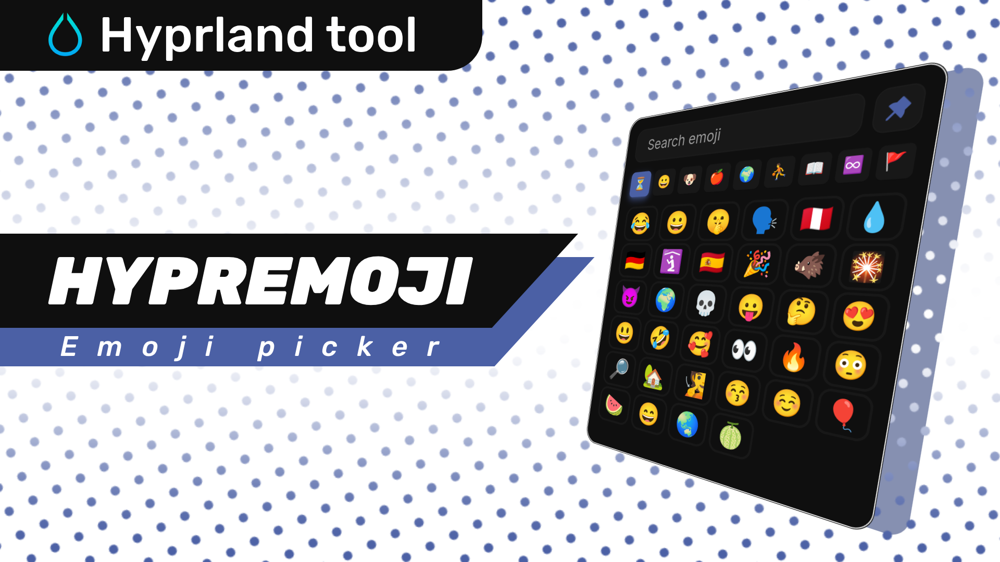
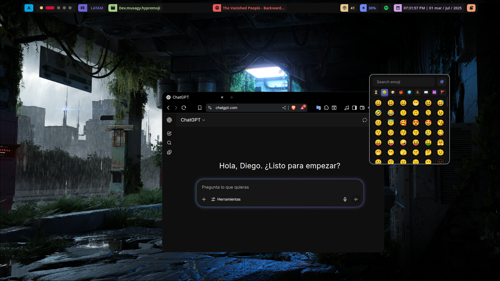

📘 Also available in [English 🇬🇧](./README.md)

# 😀 HyprEmoji

HyprEmoji es un selector de emojis ligero y rápido para el gestor de ventanas **Hyprland**, construido con GTK4 y Rust.  
¡Una forma elegante de copiar emojis en cualquier ventana de tu sistema!

  


## ✨ Características

- 🔍 **Búsqueda instantánea:** encuentra emojis escribiendo su nombre (con debounce incluido).
- 📂 **Navegación por categorías:** Caritas, Animales, Comida, Objetos ¡y más!
- 📋 **Copia automática con Ctrl+V** en la ventana enfocada.
- 🧠 **Historial reciente:** los emojis más usados se guardan automáticamente.
- 🎨 **Interfaz moderna y minimalista**, personalizable mediante CSS (también al lanzamiento con `hypremoji -s <ruta>`).
- 💾 **Recuerda el tamaño y posición de la ventana** entre sesiones.
- ⚡ **Soporte para configuración en Lua** — funciona tanto con el clásico `hyprland.conf` como con el nuevo sistema de configuración en Lua de Hyprland (`hyprland.lua`).

## 📥 Instalación

### 📦 Desde AUR *(recomendado)*

```bash
paru -S hypremoji
```

O...

```bash
yay -S hypremoji
```

> ✅ Después de instalar, ejecuta `hypremoji setup-hyprland` para una configuración automática, o si prefieres hacerlo tú mismo, copia estas líneas en tu archivo de configuración de Hyprland (`hyprland.lua` o `hyprland.conf`):
>
> **`hyprland.lua`:**
> ```lua
> package.path = package.path .. ";" .. os.getenv("HOME") .. "/.config/hypremoji/?.lua"
> require("hypremoji")
> ```
>
> **`hyprland.conf`:**
> ```conf
> source = ~/.config/hypremoji/hypremoji.conf
> ```

🎉 Lanza con `Super` + `.` ¡y a disfrutar!

## ⚙️ Instalación manual

> ⚠️ **¿Estás en Arch o una distro basada en Arch? Simplemente ejecuta `makepkg -si`** (ver arriba) en vez de seguir esta sección — es la instalación real y completa: binario en `/usr/bin`, assets en `/usr/share`, registrado por pacman, desinstalable, actualizable. Los pasos de esta sección solo producen un build local que vive dentro del repo clonado, pensado principalmente para **desarrollo/pruebas, o para distros sin `makepkg`**. Todavía no existe un equivalente de un solo comando a `makepkg -si` para otras distros — si querés una instalación real a nivel de sistema en Fedora/Debian/Ubuntu/etc., vas a tener que empaquetarlo vos mismo (`.rpm`, `.deb`) o copiar el binario y los assets a mano.

### 📦 Requisitos

- **Rust + Cargo** — instálalo vía [rustup](https://rustup.rs) en vez del paquete de tu distro; los toolchains que traen las distros suelen quedar viejos para las dependencias de este proyecto.
- **Headers de desarrollo de GTK 4** — el nombre del paquete cambia según la distro:
  - Arch: `gtk4` (headers de desarrollo y runtime vienen juntos)
  - Fedora: `gtk4-devel`
  - Debian/Ubuntu: `libgtk-4-dev`
- **pkg-config** y herramientas básicas de compilación (`gcc`, `make`) — normalmente vienen con `base-devel` (Arch), `@development-tools` (Fedora), o `build-essential` (Debian/Ubuntu).
- **Hyprland** (con `hyprctl`) — mira la [guía oficial de instalación de Hyprland](https://wiki.hyprland.org/Getting-Started/Installation/) para tu distro.
- **wl-clipboard** (`wl-copy`, `wl-paste`)
- **Fuente de emojis como Noto Color Emoji (por defecto)**

### 🚀 Pasos

1. 📥 Clona el repositorio:

```bash
git clone https://github.com/Musagy/HyprEmoji.git
cd HyprEmoji
```

2. 🛠️ Compílalo:

```bash
cargo build --release
```

> ⚠️ Corre el binario desde dentro del repo clonado (por ejemplo `./target/release/hypremoji`, justo donde corriste `cargo build`). Busca hacia arriba desde su propia ubicación las carpetas `assets/`/`config/` del proyecto, así que mover solo el binario compilado a otro lado sin el resto del repo no las va a encontrar.

3. ⚙️ Configura HyprEmoji en tu Hyprland:

```bash
./target/release/hypremoji setup-hyprland
```

Esto detecta si usas `hyprland.lua` o el clásico `hyprland.conf` y agrega las líneas correspondientes automáticamente (con un backup con timestamp del archivo antes de tocarlo). ¿Prefieres hacerlo a mano? Mira el snippet en la sección de [Instalación](#-instalación) más arriba — solo ten en cuenta que la línea `bind`/`hl.bind` que se distribuye llama a `hypremoji` a secas, lo cual solo funciona si el binario está en tu `$PATH` (mira la nota de abajo).

4. 🎉 Lánzalo directo para confirmar que funciona:

```bash
./target/release/hypremoji
```

Para usar el atajo `Super` + `.` en el día a día, Hyprland necesita encontrar `hypremoji` en tu `$PATH` — este build local no lo agrega ahí. Dos opciones:
- Edita la línea `bind`/`hl.bind` que agregó `setup-hyprland`, apuntándola a la ruta completa de tu binario (por ejemplo `~/HyprEmoji/target/release/hypremoji`) — lo más simple, pero atado a esa carpeta exacta; si la movés o borrás, el atajo se rompe.
- Ejecuta `cargo install --path . --locked`, que copia el binario a `~/.cargo/bin/hypremoji` (ya está en tu `$PATH` si instalaste Rust vía rustup). Ojo: esa copia queda *fuera* del repo, así que ya no puede encontrar `assets/`/`config/` por sí sola — esto solo funciona bien si ya tenés `/usr/share/hypremoji` poblado de alguna otra forma, así que no es un camino confiable para una primera instalación.

Como las dos alternativas tienen sus asperezas, este flujo manual conviene tratarlo como una forma de compilar y probar la app, no como una instalación prolija para el uso diario fuera de Arch.

### Instalación rápida de dependencias:

```bash
# Arch
sudo pacman -S gtk4 wl-clipboard noto-fonts-emoji

# Fedora
sudo dnf install gtk4-devel wl-clipboard google-noto-emoji-fonts

# Debian / Ubuntu
sudo apt install libgtk-4-dev wl-clipboard fonts-noto-color-emoji
```

> ⚠️ También necesitas una sesión activa de Hyprland para que funcione.

## 🖱️ Comandos CLI

HyprEmoji incluye una interfaz de línea de comandos para configuración:
```bash
# Mostrar ayuda
hypremoji --help

# Lanzar con un CSS personalizado solo para esta sesión
hypremoji -s ~/.config/hypremoji/dark.css

# Resetear configuración a valores predeterminados (ventana sigue al cursor abajo)
hypremoji reset

# Configura HyprEmoji en hyprland.lua o hyprland.conf
# (seguro de correr de nuevo — no hace nada si ya estaba configurado)
hypremoji setup-hyprland
```

> 💡 **Consejo:** Por defecto, la ventana sigue tu cursor y aparece debajo de él. Puedes anclarla a una posición fija en cualquier momento usando el botón 📌 dentro de la app.

## 🎨 Personalización

Puedes modificar el tema desde:

```bash
~/.config/hypremoji/style.css
```

También puedes mantener varias variantes (por ejemplo, `dark.css`, `light.css`) y lanzar Hypremoji con cualquiera usando `hypremoji -s /ruta/al/tema.css`. Si quieres atar un tema específico a un atajo de Hyprland, edita la línea `bind = … hypremoji` correspondiente en tu configuración de Hyprland para añadir la bandera `-s` con el archivo deseado.

#### Ejemplo:

```css
:root {
  --primary-col: #4b60a5;
  --primary-col-glow: #4b60a5aa;
  --gray: #444;
  --bg-col: #0F0F0F;
  --input-text-col: #FFFFFF;
  --btn-list-col: #181818;
  --entry-unfocus: #c41313;
  --btn-list-col-hover: #272727;
  --btn-list-col-hover-glow: #27272777;
  --btn-nav-col: #3E3E3E;
  --btn-nav-col-hover: #0F0F0F;
  --emoji-font: "Noto Color Emoji";
}
```

> 💬 ¿Quieres el clásico estilo de emojis de Discord? Mira [Twemoji](https://github.com/twitter/twemoji), es la fuente que usan ellos.

#### El color de los íconos sigue tu tema automáticamente

Los íconos (como el 📌 de pin) usan el renderizado symbolic de GTK, así que su color sale directo de tu CSS — no hace falta editar ningún archivo SVG a mano. Solo modifica `--primary-col` en tu `style.css` (mira el ejemplo de arriba) y los íconos se actualizan junto con el resto del tema.

## 🤝 Contribuciones

¡Las ideas, reportes de errores y *pull requests* son muy bienvenidas!  
Abre un [issue](https://github.com/Musagy/HyprEmoji/issues) o colabora directamente.

## 📄 Licencia

Este proyecto está licenciado bajo **ISC**. Revisa [`LICENSE`](./LICENSE) para más detalles.

## 💸 Apóyame

<p align="center"> 
  <a href="https://www.buymeacoffee.com/musagy" target="_blank" >
    
  </a>
</p>

  

<p align="center"> Tengo hambre 🥵 </p>
