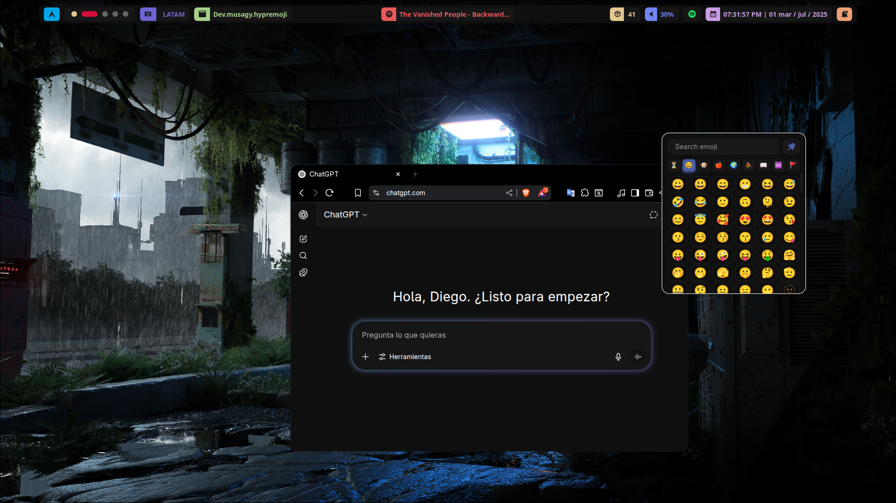

📘 También disponible en [Español 🇪🇸](./README.es.md)

# 😀 HyprEmoji

HyprEmoji is a lightweight and fast emoji picker for the **Hyprland** window manager, built with GTK4 and Rust.  
A sleek way to copy emojis into any window on your system!




## ✨ Features

- 🔍 **Instant search:** find emojis by typing their name (with debounce included).
- 📂 **Category navigation:** Smileys, Animals, Food, Objects, and more!
- 📋 **Clipboard copy with auto Ctrl+V** into the focused window.
- 🧠 **Recent history:** frequently used emojis are saved automatically.
- 🎨 **Modern and minimal UI**, customizable through CSS.
- 💾 **Remembers window size and position** across sessions.

## 📥 Installation

### 📦 From the AUR *(recommended)*

```bash
paru -S hypremoji-git
```
Or...
```bash
yay -S hypremoji-git
```

> ✅ Once installed, it will try to auto-configure your `hyprland.conf` with the necessary rules.

🎉 Launch with `Super` + `.` and enjoy!

## ⚙️ Manual Installation


### 📦 Requirements

- **Rust + Cargo**
- **GTK 4**
- **Hyprland** (with `hyprctl`)
- **wl-clipboard** (`wl-copy`, `wl-paste`)
- **Noto Color Emoji (Default)** or similar font 

### 🚀 Steps

1. 🎯 Make sure you have **Rust** and **GTK 4** installed.
2. 📥 Clone the repo:

```bash
git clone https://github.com/Musagy/HyprEmoji.git
cd HyprEmoji
```
> Using Arch? Just run `makepkg -si` and you’re done.
>
> Otherwise, continue with the steps below.

3. ⚙️ Add this to your `hyprland.conf`:

```conf
# Env for build
$hypremoji = ~/path/to/project/target/release/hypremoji

# SUPER + PERIOD to open Hypremoji
bind = $mainMod, period, exec, $hypremoji

# WindowRules for HyprEmojis
windowrulev2 = float, title:^(HyprEmoji)$
```

4. 🛠️ Build it:

```bash
cargo build --release
```

5. 🎉 Launch with `Super` + `.` and enjoy!

### Quick dependency install (Arch Linux):

```bash
sudo pacman -S gtk4 wl-clipboard noto-fonts-emoji
```

### On Debian/Ubuntu:

```bash
sudo apt install libgtk-4-dev wl-clipboard fonts-noto-color-emoji
```

>⚠️ You also need a running Hyprland setup for this to work!

## 🎨 Customization

You can tweak the theme via:

```bash
~/.config/hypremoji/style.css
```

#### Example:

```css
:root {
  --primary-col: #4b60a5;
  --primary-col-glow: #4b60a5aa;
  --gray: #444;
  --bg-col: #0F0F0F;
  --input-text-col: #FFFFFF;
  --btn-list-col: #181818;
  --entry-unfocus: #c41313;
  --btn-list-col-hover: #272727;
  --btn-list-col-hover-glow: #27272777;
  --btn-nav-col: #3E3E3E;
  --btn-nav-col-hover: #0F0F0F;
  --emoji-font: "Noto Color Emoji";
}
```

> 💬 Want that classic Discord emoji look? Check out [Twemoji](https://github.com/twitter/twemoji), it's the same font they use.

#### How change the 📌 icon color:

Edit the `fill="#xxxxxx"` values in:

```bash
/usr/share/hypremoji/assets/icons/AiFillPushpin.svg
```

## 🤝 Contributions

Ideas, bug reports, and pull requests are very welcome!  
Open an [issue](https://github.com/Musagy/HyprEmoji/issues) or collaborate directly.

## 📄 License

This project is licensed under **ISC**. See [`LICENSE`](./LICENSE) for more details.

## 💸 Support me 

<p align="center"> 
  <a href="https://www.buymeacoffee.com/musagy" target="_blank" >
    
  </a>
</p>

  

<p align="center"> I'm hungry 🥵 </p>
